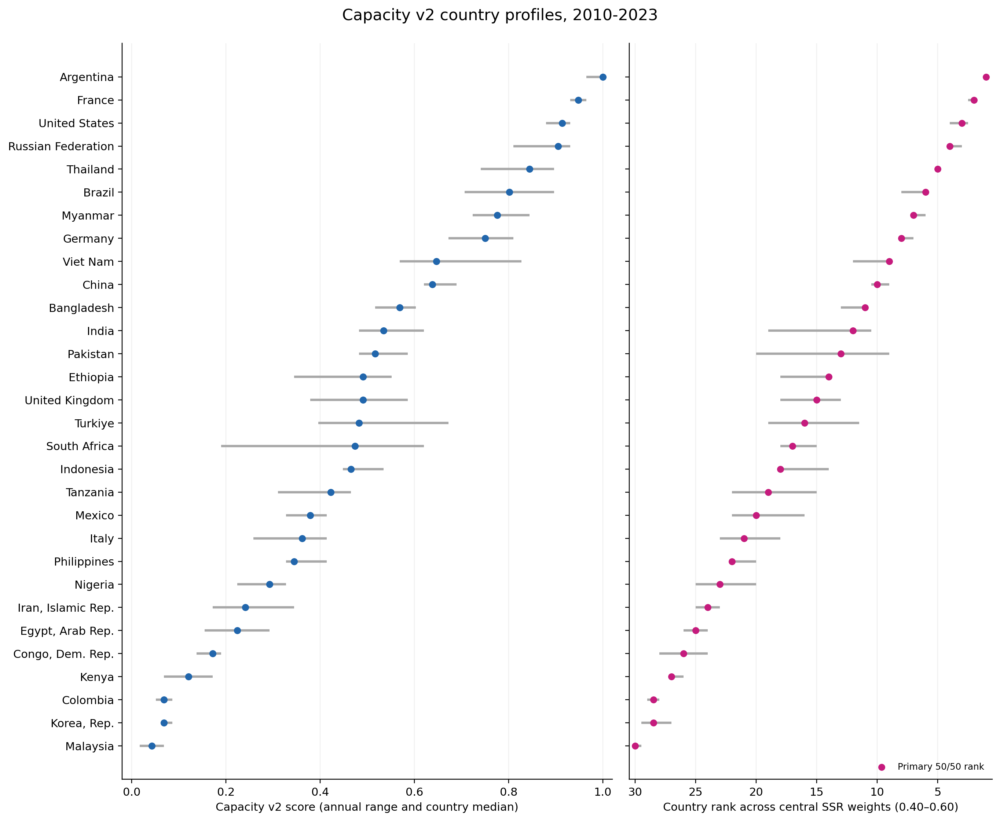

# Transparent Cereal Capacity Index

[](https://github.com/Kind-NK-Hill/food-security-capacity-index/actions/workflows/ci.yml)

A reproducible 30-country case study of transparent composite-index design,
expert-hypothesis testing, country structure, and cautious interpretable
modeling.

> This is a revised implementation of a collaborative course project. The
> repository documents a later AI-assisted reconstruction; it does not claim
> that the original team submission was completed independently by one person.



## Research question

Can official data support a transparent ranking of national cereal supply and
trade capacity, and which structural indicators remain associated with that
constructed score when entire countries are held out of model training?

This is **not** a forecast, causal model, household food-security measure, or
universal country ranking.

## What the project does

```text
World Bank WDI + FAOSTAT
          │
          ▼
Capacity Score v2 = 0.5 x annual-rank(SSR)
                  + 0.5 x annual-rank(cereal production/person)
          │
          ├── weight and normalization sensitivity
          ├── preserved expert hypotheses
          ├── exploratory Ward country profiles
          ├── country-grouped OLS + one shallow random forest
          └── descriptive alignment with official PoU and FIES
```

The modern index covers 30 countries from 2010-2023. The explanatory models
use six prespecified, non-component WDI indicators over 2010-2021. Japan is
not imputed into the modern index because its FAOSTAT Food Balances cereal
series is absent for this window.

## Main findings

- The 50/50 and 56/44 country rankings are almost identical
  (Spearman 0.998); rank versus annual min-max normalization is 0.989.
- No value among 101 SSR weights satisfies all four preserved Legacy category
  orderings. The expert labels are retained as comparison slices, not forced
  into the score.
- Ward clustering selects four exploratory groups, but a singleton and a
  two-country cluster show that extreme profiles partly drive the cut.
- A shallow random forest improves pooled country-grouped MAE from 0.230 to
  0.192, yet only two of five folds have positive R-squared. This is limited,
  heterogeneous structural explanation rather than dependable prediction.
- Arable land per person is the only predictor with positive held-out
  permutation importance in all five folds.
- Capacity v2 aligns modestly in the expected inverse direction with PoU
  (Spearman -0.31) and FIES (-0.27); this does not validate it as a hunger or
  household-access measure.

The concise technical report is available at
[`report/Food_Security_Capacity_Index.pdf`](report/Food_Security_Capacity_Index.pdf).

## Repository structure

```text
.
├── config/                 # frozen scope, weights, indicators, categories
├── data/processed/         # compact reproducible input snapshots
├── docs/                   # method protocol
├── figures/                # report figures (SHAP remains appendix-only)
├── report/                 # LaTeX source and compiled report
├── results/core/           # compact published result tables
├── scripts/                # acquisition, index build, analysis, verification
├── tests/                  # deterministic helper and guardrail tests
├── DATA_SOURCES.md         # source attribution and data terms
└── THIRD_PARTY_NOTICES.md  # license boundaries
```

The original 154-page submission, original R Markdown, virtual environment,
raw third-party workbooks, private paths, and team-internal materials are not
included.

## Quick reproduction from the frozen snapshot

Python 3.12 is recommended.

```bash
python -m venv .venv
# Windows: .venv\Scripts\activate
# macOS/Linux: source .venv/bin/activate
python -m pip install --upgrade pip
python -m pip install -r requirements.txt

python -m unittest discover -s tests -p "test_*.py" -v
python scripts/verify_release.py

python scripts/run_analysis.py \
  --run-date 2026-08-29 \
  --output-dir results/generated/reproduction \
  --figure-dir figures/generated/reproduction
```

The full run uses 500 within-country clustering bootstraps, five country-grouped
folds, and cross-fitted SHAP. For a fast smoke run, add
`--cluster-bootstraps 25`. Output directories are never overwritten silently.

## Refreshing official data

Frozen reproduction and live refresh are intentionally separate. A refresh may
change results because World Bank and FAO revise historical series.

```bash
python scripts/download_world_bank.py --snapshot-date YYYY-MM-DD
python scripts/download_official_outcomes.py --snapshot-date YYYY-MM-DD

python scripts/build_capacity_index.py \
  --ssr-input data/processed/official_outcomes/YYYY-MM-DD/fbs_cereal_ssr_31countries_2010_2023.csv \
  --wdi-input data/processed/world_bank/YYYY-MM-DD/wdi_31countries_1994_2025_long.csv \
  --run-date YYYY-MM-DD

python scripts/download_explanatory_wdi.py \
  --snapshot-date YYYY-MM-DD \
  --capacity-input results/generated/capacity/YYYY-MM-DD/capacity_v2_panel.csv

python scripts/run_analysis.py \
  --run-date YYYY-MM-DD \
  --explanatory-dir data/processed/explanatory_refresh/YYYY-MM-DD \
  --capacity-dir results/generated/capacity/YYYY-MM-DD \
  --outcomes-file data/processed/official_outcomes/YYYY-MM-DD/outcome_benchmark_source_panel_2000_2025.csv \
  --output-dir results/generated/analysis/YYYY-MM-DD \
  --figure-dir figures/generated/analysis/YYYY-MM-DD
```

The optional `--include-ghi` flag downloads GHI for local-only sensitivity
work; GHI data are excluded from the public repository.

## Method guardrails

- All years of a country stay in the same validation fold.
- Target ingredients, PoU, FIES, and GHI are excluded from model predictors.
- Only OLS and one fixed shallow random forest are used.
- No t-SNE, model-family sweep, XGBoost/LightGBM, Category ICE/PDP, unrestricted
  SHAP dependence gallery, forecast, or causal identification is added.
- SHAP is an appendix diagnostic and cannot override held-out permutation
  importance or fold heterogeneity.

## Tests and verification

- Six deterministic unit tests cover the Legacy simplex helper, preprocessing,
  grouped permutation, manifest/coverage gates, and ISO3-year joins.
- The release verifier checks input/output contracts, expected row counts,
  prohibited files, machine-specific paths, common secret patterns, figure
  readability, and the published headline metrics.
- The private reconstruction result package separately passed 44/44 checks;
  only the public-safe verification summary is retained here.

## Data, licensing, and attribution

- Original repository code: MIT; see [`LICENSE`](LICENSE).
- World Bank WDI and FAOSTAT data retain source licenses and attribution terms;
  see [`DATA_SOURCES.md`](DATA_SOURCES.md).
- The MIT license does not cover third-party data, the report, or figures.
- No source organization endorses this project.

## Reuse

The scripts accept explicit input/output paths, refuse silent overwrites, keep
provenance hashes, and separate frozen reproduction from live refresh. To reuse
the analysis with another country set, preserve the documented CSV schemas and
update the explicit scope checks rather than silently dropping countries.
